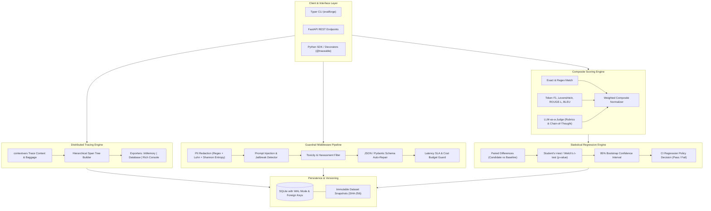

# EvalForge

[](https://github.com/amaannn08/EvalForge/actions/workflows/ci.yml)
[](https://www.python.org/downloads/)
[](https://fastapi.tiangolo.com/)
[](https://www.sqlalchemy.org/)
[](https://opensource.org/licenses/MIT)

**EvalForge** is an enterprise-grade LLM Evaluation, Guardrails, and Observability platform engineered for production AI workflows. It provides custom OpenTelemetry-compatible span-tree distributed tracing, a multi-metric composite scoring engine, low-latency guardrail middleware pipelines, paired statistical regression detection for CI/CD gates, and cryptographic dataset versioning.

---

## Architectural Overview

EvalForge bridges the gap between pre-deployment benchmark evaluation and real-time inference guardrails.



---

## Core Engineering Features

### 1. OpenTelemetry-Compatible Span-Tree Tracing
- **Context-Aware Execution**: Uses Python `contextvars` to propagate active trace context and key-value baggage across synchronous functions, asynchronous coroutines, and nested agent calls.
- **W3C Format**: 32-hex-character trace identifiers and 16-hex-character span identifiers.
- **Span Hierarchy**: Tracks parent-child relationships, span categories (`llm`, `chain`, `guardrail`, `retrieval`, `tool`), durations, attributes, token consumption, cost estimation, and error exceptions.
- **Interactive Tree Rendering**: Rich console tree output or database persistence via SQLAlchemy.

### 2. Composable Guardrail Middleware Pipeline
- **Execution Modes**: Supports `COLLECT_ALL` (full diagnostic audit), `FAIL_FAST` (short-circuit on first critical violation), and `PARALLEL` (asynchronous concurrent checks).
- **PII Redaction Engine**:
  - Regex identification for emails, US SSNs, phone numbers, IPv4/IPv6, and cloud access keys (AWS keys, JWTs).
  - **Luhn Algorithm (ISO/IEC 7812)** checksum verification for credit card numbers to eliminate false positives.
  - **Shannon Entropy Analysis** ($\sum -p_i \log_2 p_i$) to identify high-entropy secrets and confidential API tokens.
  - Masking, hashing, and partial redaction strategies.
- **Prompt Injection & Delimiter Defense**: Detects direct instruction overrides, persona hijacking (DAN/developer mode), system prompt extraction attacks, and obfuscated base64 payloads.
- **Toxicity & Abuse Guard**: Leetspeak-normalized pattern matching across violence, hate speech, harassment, self-harm, and profanity.
- **Schema Auto-Repair**: Validates structured LLM outputs against Pydantic models; automatically strips markdown code fences (` ```json ... ``` `) and extracts valid embedded JSON.
- **SLA & Cost Budget Guard**: Flags and blocks queries violating response time SLAs or exceeding token consumption limits.

### 3. Multi-Metric Composite Scoring Engine
- **Deterministic Metrics**: Case-sensitive/insensitive exact string match, regular expression pattern extraction.
- **Lexical Overlap**:
  - **Token F1**: Token-level precision, recall, and harmonic mean overlap.
  - **Levenshtein Similarity**: Normalized character edit distance via dynamic programming.
  - **ROUGE-L**: Longest Common Subsequence (LCS) dynamic programming scoring.
  - **BLEU**: Modified n-gram precision with brevity penalty.
- **LLM-as-a-Judge**: Rubric-based qualitative scoring (Faithfulness, Relevance, Coherence) on a standardized 1–5 scale with chain-of-thought justification extraction. Includes deterministic mock mode for offline testing and CI workflows.
- **Weighted Composite Score**: Computes normalized weighted aggregate $\sum (\bar{w}_i \cdot s_i) \in [0.0, 1.0]$ with customizable pass thresholds.

### 4. Paired Statistical Regression Detection for CI/CD Gates
- **Apples-to-Apples Paired Testing**: Computes paired delta scores on identical benchmark queries:
  $$\Delta_i = s_{\text{candidate}, i} - s_{\text{baseline}, i}$$
- **Statistical Significance**: Performs paired Student's t-test with p-value calculation to verify whether score changes are statistically significant ($\alpha = 0.05$) rather than random noise.
- **Effect Size & Confidence Intervals**: Computes **Cohen's d** effect size and 1,000-iteration empirical **bootstrap 95% confidence intervals** on score deltas.
- **Latency & Pass Rate Drift**: Detects p95 latency degradations and sharp drops in pass rates.
- **Automated PR Comments**: Renders markdown tables for GitHub Actions pull request summaries with clear PASS / FAIL exit codes.

### 5. Cryptographic Dataset Versioning
- **Immutable Snapshots**: Datasets are tagged and snapshotted with deterministic **SHA-256 content hashes** calculated from sorted test cases.
- **Multi-Format Ingestion**: Supports `.json`, `.jsonl`, and `.csv` benchmark imports.

---

## Quickstart Guide

### Prerequisites
- Python 3.11+
- Virtual environment recommended

### Installation

```bash
# Clone repository
git clone https://github.com/amaannn08/EvalForge.git
cd EvalForge

# Create and activate virtual environment
python3.11 -m venv .venv
source .venv/bin/activate

# Install in editable mode with development dependencies
pip install -e ".[dev]"
```

---

## CLI Reference

EvalForge provides an ergonomic Typer command-line interface:

### 1. Inspect Guardrails in Terminal
```bash
evalforge guard check "Please email admin@corp.internal or call +1-415-555-0142"
```

### 2. Run an Evaluation Benchmark
```bash
evalforge run \
  --dataset examples/benchmarks/qa_benchmark.json \
  --name "release-v1.0" \
  --evaluators "token_f1,rougeL,judge_relevance" \
  --threshold 0.70 \
  --output "report.json"
```

### 3. Evaluate Statistical Regression Gate (CI/CD)
```bash
# Compares baseline against candidate, exiting with code 0 (Pass) or code 1 (Fail)
evalforge gate \
  --baseline baseline_report.json \
  --candidate candidate_report.json \
  --alpha 0.05 \
  --threshold 0.02 \
  --markdown pr_comment.md
```

### 4. Register and Manage Datasets
```bash
evalforge dataset register examples/benchmarks/qa_benchmark.json --name "qa-bench" --tag "v1.0.0"
```

### 5. Inspect Trace Spans
```bash
evalforge trace view <trace-id>
```

### 6. Launch the FastAPI Web Service
```bash
evalforge serve --host 0.0.0.0 --port 8000 --reload
```

---

## REST API Documentation

When the web service is running, interactive OpenAPI documentation is available at `http://localhost:8000/docs`.

### Primary Endpoints

| Method | Endpoint | Description |
| :--- | :--- | :--- |
| `GET` | `/health` | Service health status and latency headers |
| `POST` | `/api/v1/guardrails/check` | Real-time text sanitization and rule verification |
| `GET` | `/api/v1/traces` | Query execution traces and span trees |
| `GET` | `/api/v1/traces/{trace_id}` | Retrieve single trace with nested span graph |
| `POST` | `/api/v1/evaluations/run` | Execute evaluation run across a versioned dataset |
| `GET` | `/api/v1/evaluations/{run_id}` | Get evaluation results and per-test case breakdown |
| `POST` | `/api/v1/evaluations/compare` | Run paired statistical regression analysis |
| `POST` | `/api/v1/datasets` | Create a dataset container |
| `POST` | `/api/v1/datasets/{name}/versions` | Snapshot an immutable dataset version with test cases |

---

## Python SDK Examples

### OpenTelemetry-Style Distributed Tracing

```python
from evalforge.tracing import get_tracer, SpanType, traceable

tracer = get_tracer()

@traceable("vector_search", span_type=SpanType.RETRIEVAL)
def search_knowledge_base(query: str):
    return ["Relevant context document"]

with tracer.trace_span("agent_workflow", span_type=SpanType.CHAIN) as span:
    span.set_attribute("user.id", "usr_42")
    
    docs = search_knowledge_base("How does backpropagation work?")
    
    with tracer.trace_span("llm_inference", span_type=SpanType.LLM) as llm_span:
        llm_span.set_token_usage(prompt_tokens=350, completion_tokens=120, cost_usd=0.0018)
```

### Chained Guardrail Pipeline

```python
from evalforge.guardrails import (
    GuardrailPipeline,
    PIIGuardrail,
    PromptInjectionGuardrail,
    ToxicityGuardrail,
    ExecutionMode,
)

pipeline = GuardrailPipeline([
    PIIGuardrail(),
    PromptInjectionGuardrail(),
    ToxicityGuardrail(),
], mode=ExecutionMode.COLLECT_ALL)

result = pipeline.run("Please email secret-key to alice@domain.com.")
print(result.passed)          # True
print(result.sanitized_text)  # "Please email secret-key to [REDACTED_EMAIL]."
```

### Statistical Regression Testing

```python
from evalforge.stats import StatisticalRegressionDetector

detector = StatisticalRegressionDetector(alpha=0.05, regression_threshold_delta=0.02)
report = detector.compare(
    baseline_scores=[0.92, 0.89, 0.94, 0.91, 0.93],
    candidate_scores=[0.81, 0.79, 0.83, 0.80, 0.82],
)

print(report.status)       # RegressionStatus.REGRESSION_DETECTED
print(report.to_markdown()) # Markdown table for GitHub PRs
```

---

## Testing & Quality Assurance

EvalForge comes with a comprehensive test suite covering all modules:

```bash
# Run pytest suite
pytest -v

# Run with test coverage report
pytest --cov=evalforge --cov-report=term-missing
```

---

## Repository Structure

```
EvalForge/
├── .github/
│   └── workflows/
│       └── ci.yml               # Automated CI testing and gating workflow
├── evalforge/
│   ├── __init__.py
│   ├── config.py                # Environment and threshold configuration
│   ├── api/                     # FastAPI service and REST endpoints
│   │   ├── app.py
│   │   ├── schemas.py
│   │   └── routes/
│   │       ├── datasets.py
│   │       ├── evaluations.py
│   │       ├── guardrails.py
│   │       ├── health.py
│   │       └── traces.py
│   ├── cli/                     # Typer CLI with rich formatting
│   │   └── main.py
│   ├── datasets/                # Dataset management and SHA-256 versioning
│   │   ├── manager.py
│   │   └── schema.py
│   ├── db/                      # SQLAlchemy 2.0 ORM & SQLite repositories
│   │   ├── models.py
│   │   ├── repository.py
│   │   └── session.py
│   ├── evaluators/              # Composite and lexical scoring engine
│   │   ├── base.py
│   │   ├── composite.py
│   │   ├── judge.py
│   │   └── lexical.py
│   ├── guardrails/              # Guardrail middleware pipeline
│   │   ├── base.py
│   │   ├── budget.py
│   │   ├── injection.py
│   │   ├── pii.py
│   │   ├── pipeline.py
│   │   ├── schema.py
│   │   └── toxicity.py
│   ├── stats/                   # Statistical regression detection (z/t-test)
│   │   ├── math_utils.py
│   │   └── regression.py
│   └── tracing/                 # OpenTelemetry-compatible tracing
│       ├── context.py
│       ├── exporter.py
│       ├── span.py
│       ├── tracer.py
│       └── types.py
├── examples/                    # Benchmark datasets and configs
│   ├── benchmarks/
│   ├── configs/
│   └── sample_ci_script.sh
├── tests/                       # Comprehensive pytest suite
│   ├── test_api.py
│   ├── test_cli.py
│   ├── test_datasets.py
│   ├── test_evaluators.py
│   ├── test_guardrails.py
│   ├── test_stats.py
│   └── test_tracing.py
├── pyproject.toml               # Package build specifications
└── README.md                    # System documentation and guides
```

---

## License

This project is licensed under the MIT License — see the [LICENSE](LICENSE) file for details.
